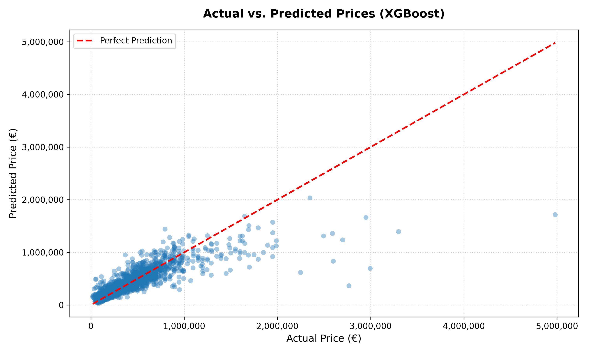
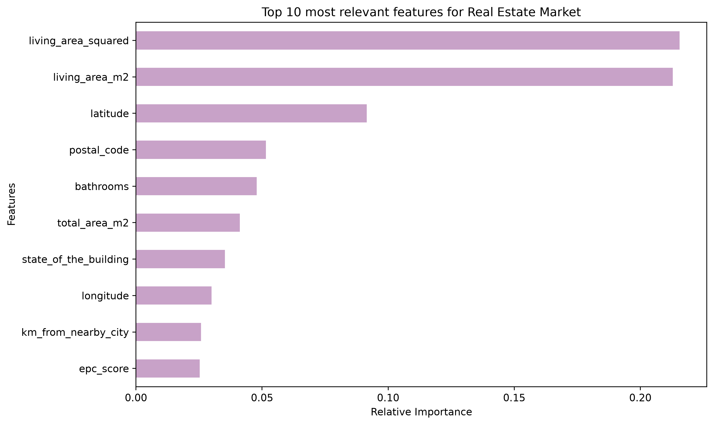

# 🏡 Immo-Eliza Machine Learning Model 🚀


[](https://becode.org/)


**Repository:** `immo-eliza-ml`  
**Type:** `Learning + Consolidation`  
**Duration:** `5 days`  
**Deadline:** `03/07/2026, 4:30 pm`  
**Team:** solo  

---

## 📋 Project Overview
This repository contains an end-to-end Machine Learning pipeline tailored to predict real estate property prices in Belgium using an optimized **XGBoost Regressor**, achieving a validated **R² score of 69.57%** on the test set.  
This project was part of Sprint 3 of 4 of the ImmoEliza curriculum.

---

## ⭐️ Project Summary

### 📌 Situation
The objective was to deploy a predictive Machine Learning model for Immo Eliza based on highly volatile and noisy scraped real estate data from the Belgian market, which featured heavy price asymmetry, missing fields, and significant structural anomalies.

### 🎯 Task
Develop a robust feature preprocessing pipeline to handle missing values, optimize categorical variable encodings, and isolate experimental modeling from final test validation. The target was to surpass linear baselines and achieve an R² performance metric within the training specifications provided by the coaching team.

### 🛠️ Action
1. **Pipeline Isolation:** Built a strict initial data-splitting step to safeguard a 20% validation/test set, completely preventing data leakage across the entire development lifecycle.
2. **Advanced Preprocessing:** Engineered explicit handling strategies for missing feature values and mapped categorical dimensions using optimized numerical encodings.
3. **Outlier Mitigation Strategy:** Identified and stripped extreme price points (the 1% distribution tails) exclusively within the training matrix (`X_train_clean`), stabilizing the gradient boosting residual weight function.
4. **Hyperparameter Tuning:** Conducted a comprehensive multi-stage grid search (`GridSearchCV`) tracking the $R^2$ coefficient, expanding execution boundaries to a regularized design space (`max_depth=5`, `n_estimators=600`, `min_child_weight=6`).
5. **Production Engineering:** Industrialized experimental Jupyter research workflows into a reusable software structure, implementing binary object serialization using `joblib`.

### 🏆 Result
The optimized model recorded a decisive performance increase, escalating from an initial linear baseline of **50.08%** to a resilient cross-validated **69.57% R² score** on the final test set, settling into a stable setup while ensuring strong generalization bounds.

---

## 🧮 Model Performance Metrics
Evaluating the production-ready model yielded the following validation profile on the test set:

| Metric | Score / Value |
| :--- | :--- |
| **R² Score** | 69.57 % |
| **MAE** | 85,906.43 € |
| **RMSE** | 181,299.07 € |

---

## 📊 Model Evaluation & Comparison
A rigorous benchmarking process was conducted across multiple algorithms. The table below illustrates the performance leap achieved by transitioning from linear baselines to ensemble methods, combined with strategic outlier mitigation:

| Model | Train R² | Test R² | Train MAE | Test MAE |
| :--- | :--- | :--- | :--- | :--- |
| **Ridge (Baseline)** | 62.41 % | 50.08 % | 103,864.96 € | 117,797.42 € |
| **Decision Tree** | 69.98 % | 52.89 % | 94,931.03 € | 120,395.83 € |
| **Random Forest** | 96.52 % | 65.19 % | 28,620.73 € | 91,637.64 € |
| **XGBoost (Optimized)** | 96.94 % | 69.57 % | 30,928.37 € | 85,906.43 € |



### Key Takeaways:
* **The Ensemble Advantage:** Tree-based models (`XGBoost` and `Random Forest`) significantly outperformed linear models, capturing the non-linear dynamics of the Belgian real estate market.
* **Impact of Outlier Removal:** Cleaning the top and bottom 1% price anomalies stabilized the gradient boosting process, pushing the final XGBoost Test $R^2$ to **69.57%** and reducing the MAE significantly compared to all other candidates.

---

## 🔍 Feature Importance (Model Explainability)
To understand what drives real estate prices in the Belgian market, the top 10 most impactful features extracted by the optimized XGBoost model were analyzed:



### Key Insights from the Model:
* **Living Area & Property Structure:** The overall size of the property remains the strongest driver for valuation.
* **Geographical Impacts:** Regional and provincial encoding weights confirm that location drastically shifts the baseline price criteria across Belgium.

---

## 🚀 How to Run

### Installation  
Deploy dependencies into your virtual environment:
```bash
pip install -r requirements.txt
```

### Training Pipeline
Re-run the training process and serialize the model architecture:
```bash
python src/train.py
```

### Inference Engine
Generate predictions against target dummy data shapes:
```bash
python src/predict.py
```

---

## 📁 Repository Structure
```text
immo-eliza-ml/
│
├── data/
│   ├── raw/                              <-- Contains properties_final_irene.csv and other original datasets used
│   │   ├── train_test                    <-- Contains datasets after splitting
│   │   └── StatBel                       <-- Contains datasets from StatBel used in feature engineering phase
│   │    
│   └── cleaned/                          <-- Contains splitted and preprocessed datasets for training:
│                                             X_train_clean.csv & y_train_clean.csv
├── images/                        
│   ├── charts/
│   │   └── model_comparison_results.png  <-- Comparison table with obtained metrics for each model
│   └── plots/
│       ├── decision_tree_vis.png         <-- Decision tree visualization
│       ├── predict_vs_actual.png         <-- Validation plot comparing true vs predicted values
│       └── top_10_most_relevant_feat.png <-- Top 10 most relevant features bar plot
├── models/
│   └── xgboost_model.joblib              <-- Serialized production artifact
├── src/
│   ├── utils/
│   │   └── metrics_utils.py              <-- Metric calculation utilities
│   ├── train.py                          <-- Executable pipeline to train and dump the model
│   └── predict.py                        <-- Executable script for inference testing
├── requirements.txt                      <-- Third-party library dependencies
└── README.md
```

---

## 🔧 Preparation for Immo-Eliza-ML - Sprint 3 of 4
The following schema illustrates the chronological and conceptual workflow that has been adopted during the project.
```text
ImmoEliza-ml Project Organization and Execution Pipeline with content used for each step
│
├── 1. Data Splitting ─────────> Reference: 03-data-splitting.ipynb
│                               (Immediate isolation of Train and Test to secure the data)
│
├── 2. Data Preparation ───────> Reference: 01-preprocessing.ipynb
│                               (Imputer, Encoder, and Scaler: fit on Train, transform on Test)
│
├── 3. Baseline Model ─────────> Reference: 02-multiple-linear-regression.ipynb
│                               (Initial linear model and benchmark metrics)
│
├── 4. Model Comparison ───────> Reference: 03-regression-models-comparison.ipynb
│                               (Decision Trees, Random Forest, XGBoost)
│
└── 5. Optimization ───────────> Reference: 04-hyperparameter-tuning.ipynb & 02-overfitting.ipynb
                                 (GridSearchCV, Cross-Validation, Overfitting analysis)
```
